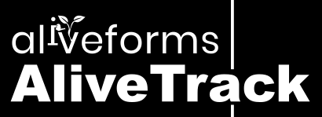

# AliveTrack - Quick Website Creation with File-Based Routing (An Aliveforms Project)




**AliveTrack is an open-source project of [Aliveforms](https://www.aliveforms.com/).**


AliveTrack is a lightweight PHP framework designed to help you create websites rapidly by utilizing file-based routing and SEO-friendly route handling. It simplifies the process of building web applications by automatically mapping URIs to corresponding files, providing HTML templates, and allowing you to define classes and methods for dynamic content generation.

**Note:** AliveTrack is currently in its early stages of development. Contributions from the community are greatly encouraged and welcomed. As an open-source project under the umbrella of [Aliveforms](https://www.aliveforms.com/), we are committed to creating a powerful and efficient web development tool.

## Features

- **File-Based Routing**: URI paths are mapped directly to file paths, making it easy to manage routes and pages.
- **SEO-Friendly Routes**: Generate clean and search engine-friendly URLs for your web pages.
- **HTML Templates**: AliveTrack supports template inheritance through a closest `__layout.html` file. It renders and caches HTML templates from the [LightView templating engine](https://www.aliveforms.com/lightview/), another open-source project of Aliveforms.
- **Dynamic Content**: Define classes with methods that correspond to route names and HTTP request methods.
- **Efficient Handling**: Our goal is to achieve high-speed performance, with an impressive request handling capability of up to 7000 requests per second.

## Getting Started

1. Clone the AliveTrack repository to your local environment.
```
git clone https://github.com/nabeelalihashmi/alivetrack.git

```
2. Set up a web server (e.g., Apache, Nginx) to point to the project directory.
3. Define your HTML templates in the `app` directory, and create corresponding PHP files to handle dynamic content.
4. Create classes that follow the naming convention and structure outlined below.
5. To modularize your templates, put chunks of reusable content in the `app/includes` directory within the `app/pages` directory.

## Dynamic Content

To handle dynamic content, you can define classes and methods based on route names and HTTP request methods. For instance, `pages/view/1` will trigger the method `getView($id)` in the class `pages` for a GET request.

## HTML Template Structure

AliveTrack requires at least one layout (`__layout.html`) file, which defines the overall structure of your web pages. This layout will be used as the base template for rendering your pages.

## Snippets for VSCode

In extras, find file `snippets` and add them in Visual Studio Code for quickly creating layouts and pages.

## Contributing

Contributions are welcome and highly encouraged! Since AliveTrack is in its early stages, your input can play a significant role in shaping its development. If you find any issues, have suggestions, or want to enhance AliveTrack, please submit pull requests or raise issues in the GitHub repository.

## License

AliveTrack is released under the [MIT License](LICENSE).

---

Enjoy rapid web development with AliveTrack and create stunning websites effortlessly!
